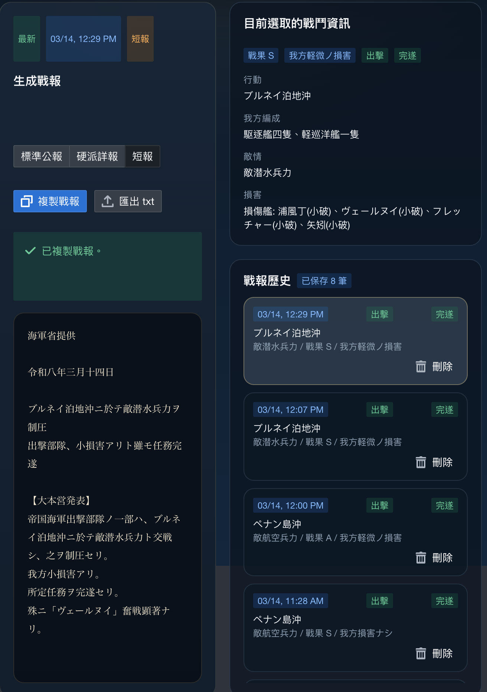

# KC War Report

Poi plugin for turning KanColle sortie results into IJN-flavored documents, bulletins, and local pseudo reports.

這是一個給 Poi 用的 `for fun` plugin。
它不打算幫玩家「更有效率地玩艦娘」，而是把艦娘的戰鬥結果、海域印象、與假想情境，轉寫成比較像 IJN 文書會長出的字。



## What This Project Is

This project is best understood as a **local writing / intelligence / propaganda sandbox built on top of KanColle**.

它現在有兩條主要來源線：

- `live_sortie`
  - 把真實 sortie / 演習結果轉成不同文書
- `sandbox`
  - 用本地 preset 海域、敵情主題、戰果口徑，生成擬制公報與參考文書

也有兩條明確不同的 truth policy：

- `硬派詳報`
  - 前線艦隊司令往上級回報
  - 必須說真話
- `標準公報` / `短報`
  - 大本營對人民的公告
  - 可以失真、可以誇大、可以故意把壞結果寫成像勝利

## Core Principle / 大原則

Because this plugin is **for fun**, user-facing wording should feel closer to something an IJN-style document might plausibly say than to raw KanColle UI text.

因此這個 plugin 的優先順序是：

- 保留能幫助邏輯判斷的 game data
- 但 user-facing text 優先使用 IJN 風的字面
- `硬派詳報` 不直接漏出 `S / A / B` 這類遊戲 UI 字級
- 寫不到的細節就寫 `未詳` / `細目未詳`
- `標準公報` / `短報` 可以強宣傳，但不亂捏 repo 根本沒有的精確數字

如果未來有取捨，原則是：

- `硬派詳報`：更像上申文書，而且仍然誠實
- `標準公報` / `短報`：更像大本營公告，而且更荒謬地自信

## What It Does Now / 現在能做什麼

### 1. Live sortie documents

同一筆真實 capture，現在可以生成三種文書：

- `標準公報`
  - 大本營正式公告風
  - 是 public propaganda layer
  - 會把真實戰況轉寫成對外可發布的官樣公報
- `短報`
  - 大本營逐號速報風
  - 比 `標準公報` 更短、更尖、更敢吹
  - 不是單純縮短版 prose，而是 bulletin / dispatch 節奏
- `硬派詳報`
  - 前線艦隊司令往上呈報的 truth-first 文書
  - 以章節與交戰點小節構成
  - 不知道的地方就老實寫 `未詳`

### 2. Local sandbox documents

現在主頁也有 `Sandbox / 文書遊戯` 面板，可用本地 preset 直接生成：

- `擬制標準公報`
- `擬制短報`
- `戦闘参考詳報`
- `作戦準備覚書`

這一區：

- 不寫入 live battle history
- 不需要真實 sortie
- 比較像用艦娘世界觀做文體、情報、宣傳遊戲

## Captured Facts / 實際會抓哪些事實

目前 live line 會抓到的是「安全而保守」的一層：

- 一次 sortie 從出擊到回港的一筆 session
- 一次演習的一筆結果
- 編成、旗艦、MVP
- 戰果類別與損害概況
- 敵方大類型
- node trail
- 一部分可安全使用的 battle context
- Poi API 可得時的提督名稱與軍銜

它**不是**完整 battle replay，也**不是** action-by-action 戰鬥分析器。

## What It Intentionally Does Not Do

這些是目前刻意不做的：

- 不把 full raw API packet 永久存進 history
- 不把 plugin 做成完整 battle viewer
- 不輸出 repo 無法穩定確認的精確彈數 / 魚雷數 / 擊墜數
- 不把 `硬派詳報` 和 public propaganda 混在一起
- 不為了史味去偽造它其實不知道的技術細節

## Why The Styles Behave So Differently

這不是單純「三種文風」而已，而是三種不同文件角色：

- `硬派詳報`
  - 是 internal report
  - 站在玩家提督 / 前線艦隊司令這一側
  - 對上級說真話
- `標準公報`
  - 是正式 public announcement
  - 會把真相加工成可公布版本
- `短報`
  - 是更像逐號發表的 propaganda bulletin
  - 作用是迅速、強勢、穩定民心，不是忠實記錄

## Output Direction / 出力方向

The exact text is no longer a single hard-coded template.
Saved entries keep stable wording, but different entries can choose different phrasing families.

以下範例中的固有名是 README 用的去識別化佔位名。

### `標準公報`

```text
大本営海軍部発表

令和八年三月十四日

ブルネイ泊地沖方面、敵潜航企図ヲ挫折

敵潜航兵力ニ打撃ヲ与ヘ、大ナル戦果ヲ収メタリ

帝国海軍出撃部隊ハ、同方面ニ於テ敵潜航兵力ノ蠢動ヲ察知シ、直ニ之ヲ邀撃セリ。
爾後反復攻撃ヲ加ヘ、敵企図ヲ挫折セシメ、海上交通保全ノ目的ヲ概ネ達成セリ。
```

### `硬派詳報`

```text
戦闘詳報
令和八年三月十四日
於 ブルネイ泊地沖

発：海軍少将 某
宛：聯合艦隊司令部

件名：ブルネイ泊地沖ニ於ケル敵潜航兵力交戦詳報

四、戦闘経過。
【第二交戦点】
　交戦時刻　1240
　敵情　敵深海潜水艦隊。確認艦種 潜水ヨ級、潜水カ級。
　交戦結果　敵ニ有効ナル打撃ヲ加ヘ、所定行動概ネ支障ナシ。
　交戦概要　航空攻撃ヲ伴フ交戦。砲雷戦細目未詳。
　我方被害　我方損害ナシ。
```

### `短報`

```text
大本営海軍部発表

令和八年三月十四日

ブルネイ泊地沖方面、敵企図ヲ粉砕

一、我軍、直ニ之ヲ邀撃セリ。
二、敵潜航企図ヲ挫折セシメタリ。
三、戦果顕著ナリ。
```

## Sandbox Direction / 沙盒方向

sandbox 不是要假裝成真實戰果記錄，而是做：

- pseudo public generation
- reference / planning documents
- 海域印象與敵情想定的文書化

也就是：

- 艦娘當底層素材
- 文體、情報、宣傳當玩法

## Install / 安裝

### Quick install

```bash
npm install 'git+https://github.com/kwt-klure/poi-plugin-kc-war-report.git' --prefix "$HOME/Library/Application Support/poi/plugins"
```

Then:

1. Restart Poi or reload the plugin list
2. Enable `KC War Report`
3. Run one sortie or practice, or open the sandbox panel directly
4. Open the plugin tab

### Install from source

```bash
git clone https://github.com/kwt-klure/poi-plugin-kc-war-report.git
cd poi-plugin-kc-war-report
npm install
npm pack --pack-destination dist
npm install "./dist/poi-plugin-kc-war-report-0.4.7.tgz" --prefix "$HOME/Library/Application Support/poi/plugins"
```

### Update

Run the same install command again, or repack from source and reinstall the newest tarball.

## Settings / 設定

目前比較重要的是 `硬派詳報` 的發受文設定：

- 是否優先使用 Poi API 偵測到的提督名字與軍銜
- sender fallback
- recipient

提督名稱 / 軍銜來源為本機 Poi session 的：

- `/kcsapi/api_get_member/basic`
- `/kcsapi/api_port/port`

抓不到時才退回 fallback。

## Validation / 檢證

```bash
npm install
npm run typeCheck
npm test -- --runInBand
```

## Patch Notes

See [PATCHNOTES.md](PATCHNOTES.md).
