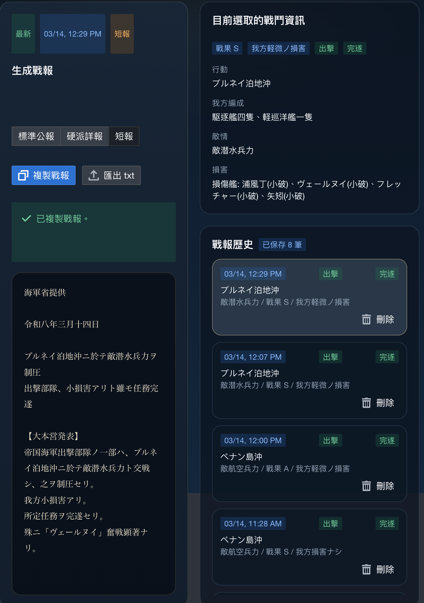
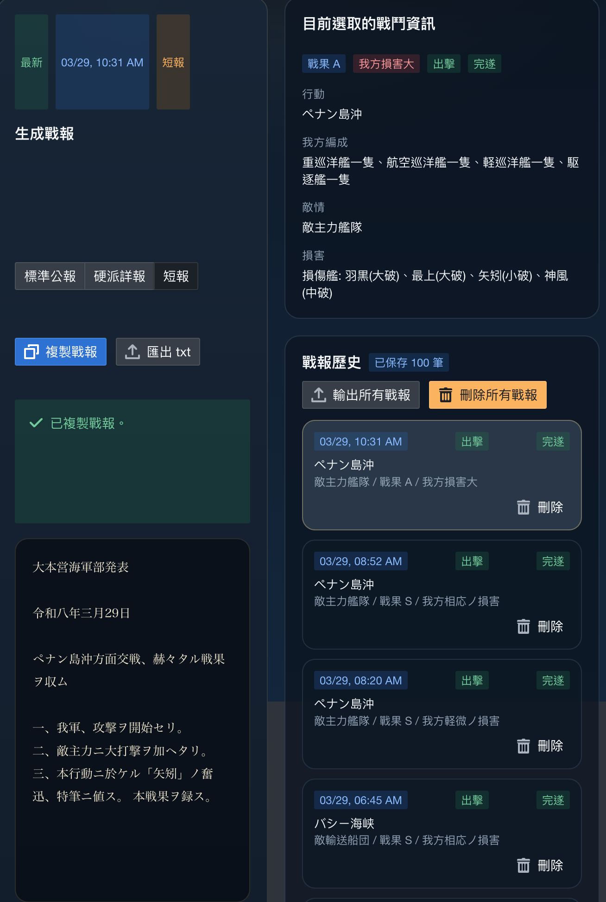

# KC War Report

Poi plugin for turning KanColle sortie results into IJN-flavored documents, bulletins, and local pseudo reports.

Poi 用の、艦これ sortie 結果を IJN 風の文書・公報・擬制報告へ変換する plugin です。



## What This Project Is

This project is a **for-fun local writing / intelligence / propaganda sandbox built on top of KanColle**.

It is not trying to become:

- a full battle analyzer
- a replay viewer
- a historical simulator

Instead, it takes the facts the plugin actually knows and rewrites them into different wartime document voices.

この project は、**艦これを土台にした for-fun のローカル文体 / 情報 / 宣伝 sandbox** です。

目指しているのは、

- 完全な battle analyzer
- replay viewer
- 史実再現 simulator

ではありません。

plugin が実際に取得できた事実を、別の戦時文書人格へ書き換えることを目的にしています。

## Core Principle

Because this plugin is **for fun**, user-facing wording should feel closer to something an IJN-style document might plausibly say than to raw KanColle UI text.

That means:

- keep game data internally when useful for logic
- prefer IJN-flavored wording in user-facing text
- avoid leaking raw `S / A / B` UI wording into `硬派詳報`
- write `未詳` / `細目未詳` instead of inventing missing detail
- allow `標準公報` and `短報` to exaggerate aggressively
- if the truth layer has a concrete wartime-style event basis, `標準公報` and `短報` may also print concrete inflated counts

この plugin は **for fun** だからこそ、user-facing text は「艦これ UI の言い換え」よりも「IJN 文書がそれらしく書きそうな字面」に寄せることを優先します。

つまり、

- 論理判断に必要な game data は内部で保持してよい
- ただし user-facing text は IJN 風の言い回しを優先する
- `硬派詳報` に raw な `S / A / B` UI 文言を漏らさない
- 書けない detail は捏造せず `未詳` / `細目未詳` と書く
- `標準公報` と `短報` は強く誇張してよい
- truth layer に wartime-style な event basis がある場合、`標準公報` と `短報` は具体的な浮報数も出してよい

## Truth Policy Split

The plugin has two different truth policies.

### `硬派詳報`

- internal report
- written as if a front-line commander is reporting upward
- truth-first

### `標準公報` / `短報`

- public propaganda layer
- written as if headquarters is announcing results to the public
- allowed to exaggerate, soften losses, and distort tone
- may use concrete inflated counts when a real event basis exists under the hood

この plugin には二つの truth policy があります。

### `硬派詳報`

- internal report
- 前線艦隊司令が上級へ報告する文書
- truth-first

### `標準公報` / `短報`

- public propaganda layer
- 大本営が対外発表する公告文
- 誇張、損害の矮小化、 tone の歪曲を許容
- 下層に実 event がある場合、具体的な浮報数を載せてもよい

## Invisible Work Still Counts

Some of the most valuable work in KanColle does not look dramatic in a simple damage ledger.

This plugin now tries to give at least a small place back to that kind of work:

- `硬派詳報` can record defensive anti-air credit in a dry, internal-report register
- `標準公報` and `短報` can then turn the same event into shameless headquarters-style enemy-aircraft claims
- if enemy carriers are ruined, the documents can also treat their embarked aircraft as having gone down with them

The point is not to become a battle simulator.
The point is to let the documents remember that ships doing invisible work still mattered.

艦これでは、damage ledger だけを見ると目立たないが、実際には大きい働きというものがあります。

この plugin は、その種の功績にも最小限の文書上の居場所を与えるようになりました。

- `硬派詳報` は、防空戦果のような働きを乾いた内部文書調で記録できる
- `標準公報` と `短報` は、同じ event を大本営風の敵機撃滅 claim へ書き換えられる
- 敵空母が重創以上になった場合、その搭載機喪失も三文書へ書き戻せる

狙いは battle simulator 化ではありません。
見えにくい働きも、文書の側ではきちんと記憶させることです。

## Why Three Document Voices Exist

These three document styles are not just longer and shorter versions of the same text.

They exist because they speak to different readers:

- `硬派詳報`
  - written upward
  - a front-line report for command
  - truth-first, even when the result is ugly
- `標準公報`
  - written outward
  - a headquarters-style public announcement
  - orderly, official, and politically filtered
- `短報`
  - written to be repeated, excerpted, and circulated
  - closer to a clipped bulletin than a paragraph summary
  - the most shameless voice in the plugin

In other words, the point is not "one report in three lengths".
The point is "one sortie seen through three different bureaucratic masks".

この三種類の document style は、単なる長文版 / 短文版ではありません。

読む相手が違うからです。

- `硬派詳報`
  - 上申文
  - 前線から上級司令部へ送る報告
  - 結果が苦しくても truth-first
- `標準公報`
  - 対外公告
  - 大本営風の正式発表
  - 整った官僚文体で、政治的に加工される
- `短報`
  - 引用・転載・流布されることを前提にした短い bulletin
  - 段落 summary より dispatch に近い
  - この plugin の中で最も shameless な声

つまり狙いは「一つの report を三段階の長さにする」ことではなく、
「一つの sortie を三つの官僚的な仮面で見せる」ことにあります。

## Why The Short Bulletin Is Fun

In one sense, even the headquarters-style public text still sounds like something written for military readers before it reaches newspapers.

That is why `短報` is intentionally terse, rigid, and overconfident.
It is supposed to sound like a bulletin that could be clipped, quoted, or passed around while ignoring the uncomfortable details.

The humor target is the deadpan mismatch:

- the fleet may come home dented
- ships may already be lining up for repairs
- but the short bulletin still declares that enemy intent was crushed and valor deserves celebration

That mismatch is not an accident.
It is a core part of the plugin's "for fun" voice.

ある意味では、大本営風の public text も、新聞に載る前の時点ではまだ「軍人が読む文」の匂いを残しています。

だから `短報` は、わざと短く、硬く、妙に自信過剰にしてあります。
段落を縮めた summary ではなく、切り抜かれ、引用され、回覧される bulletin のつもりで書かれています。

笑いどころは、その真顔の食い違いです。

- 艦隊は傷だらけで帰ってくるかもしれない
- 何隻かはそのまま入渠かもしれない
- それでも短報は「敵企図ヲ粉砕」「偉功ニ対シ慶祝ノ意ヲ表ス」と平然と書く

この食い違いは偶然ではありません。
この plugin の "for fun" な声の中心です。

## What It Does Now

### 1. Live sortie documents

From a real captured sortie or practice, the plugin can render three document styles:

- `標準公報`
  - a formal headquarters-style bulletin
  - public propaganda voice
  - rewrites the real result into a polished public statement
  - calmer and more orderly than `短報`
- `短報`
  - a short dispatch / bulletin style report
  - more compressed and more shameless than `標準公報`
  - not just a shorter paragraph, but a bulletin-like structure
  - often closer to a posted notice or circulated dispatch than to prose
- `硬派詳報`
  - a truth-first internal report
  - chaptered structure with encounter sections
  - says `未詳` when detail is missing

実際に capture された sortie / 演習一件から、現在は三種類の文書を生成できます。

- `標準公報`
  - 大本営正式公告風
  - public propaganda の声
  - 真実を対外向けの官様文へ加工する
  - `短報` より秩序立った tone を保つ
- `短報`
  - 逐号速報 / dispatch 風
  - `標準公報` より短く、尖っており、より露骨に吹く
  - 単なる短縮 prose ではなく bulletin 形式
  - 場合によっては掲示・通達に近い読感を狙う
- `硬派詳報`
  - truth-first の内部報告
  - 章立てと交戦点小節を持つ
  - detail が足りない所は `未詳` と書く

### 2. Local sandbox documents

The main page also includes a `Sandbox / 文書遊戯` panel that can generate:

- `擬制標準公報`
- `擬制短報`
- `戦闘参考詳報`
- `作戦準備覚書`

This panel:

- does not write into live battle history
- does not require a real sortie
- exists to treat KanColle as a writing / intelligence / propaganda toybox

主画面には `Sandbox / 文書遊戯` panel もあり、以下を生成できます。

- `擬制標準公報`
- `擬制短報`
- `戦闘参考詳報`
- `作戦準備覚書`

この panel は、

- live battle history に書き込まない
- 実 sortie を必要としない
- 艦これ世界を文体 / 情報 / 宣伝の遊び場として扱う

## Captured Facts

The live line currently captures a conservative, safe fact set:

- one sortie session from departure to return
- one practice result
- fleet composition, flagship, MVP
- broad result category and damage state
- broad enemy classification
- node trail
- some safe battle-context signals
- admiral identity from Poi API when available

It is **not**:

- a full battle replay
- a per-action combat analyzer
- a shell-count / torpedo-count tracker

live line が現在取得するのは、保守的で安全な fact set です。

- 出撃から帰投までの sortie session 一件
- 演習結果一件
- 編成、旗艦、MVP
- おおまかな戦果分類と損害状態
- 大分類としての敵情
- node trail
- 安全に使える範囲の battle context
- Poi API から取得可能な提督 identity

これは、

- full battle replay
- per-action combat analyzer
- 砲弾数 / 魚雷数 tracker

ではありません。

## What It Intentionally Does Not Do

- It does not store full raw API packets in history
- It does not try to become a complete battle viewer
- It does not output exact shell / torpedo / shot-down counts that it cannot verify
- It does not merge `硬派詳報` with propaganda logic
- It does not fabricate technical detail just for flavor

- full raw API packet を history に保存しない
- 完全な battle viewer を目指さない
- 確認不能な砲弾数 / 魚雷数 / 撃墜数を出さない
- `硬派詳報` と propaganda logic を混ぜない
- 史味だけのために技術 detail を捏造しない

## Example Output Direction

The exact text is no longer a single hard-coded template.
Saved entries keep stable wording, but different entries can choose different phrasing families.
Current polish work is kept intentionally render-layer-first and corpus-first: stabilize truth capture first, then refine document voices in small or medium register passes.

以下の固有名は README 用の去識別化サンプルです。
現在の polish は render-layer-first / corpus-first を意図的に維持しています。まず truth capture を安定させ、その後に small / medium な register pass で文書声線を整えます。

### `標準公報`

```text
大本営海軍部発表

令和八年三月十四日

ブルネイ泊地沖方面、敵潜航企図ヲ挫折

敵潜航兵力ニ打撃ヲ与ヘ、大ナル戦果ヲ収メタリ

帝国海軍出撃部隊ハ、同方面ニ於テ敵潜航兵力ノ蠢動ヲ察知シ、直ニ之ヲ邀撃セリ。
敵潜航企図ヲ挫折セシメ、海上交通保全ノ目的ヲ概ネ達成セリ。

当時我部隊兵力ハ、駆逐艦二隻、軽巡洋艦一隻ヲ基幹トシ、旗艦「ジョンストン」ノ下ニ整斉ナル作戦行動ヲ継続セリ。

大本営海軍部ハ本行動ノ成果ヲ公表ス。
```

### `硬派詳報`

```text
戦闘詳報
令和八年三月十四日
於 ブルネイ泊地沖

発：海軍少将 某
宛：聯合艦隊司令部

件名：ブルネイ泊地沖ニ於ケル敵潜航兵力交戦詳報

一、任務概要。
　令和八年三月十四日、ブルネイ泊地沖方面ニ於テ対潜警戒行動ニ従事。
　敵潜航兵力ト接触後、所定海面ノ警戒及掃蕩ヲ継続セリ。
二、参加兵力。
　駆逐艦二隻、軽巡洋艦一隻。旗艦「ジョンストン」。
三、敵情。
　敵情総括　敵潜水兵力。
　交戦点数　二。
四、戦闘経過。
【第一交戦点】
　交戦時刻　1234
　敵情　敵深海潜水艦隊前衛。確認艦種 潜水ソ級、潜水カ級。
　交戦結果　敵ニ打撃ヲ与ヘ、交戦目的ニ照ラシ概ネ良好ナリ。
　交戦概要　敵前衛部隊ト接触、水上交戦実施。細目未詳。
　我方被害　損傷艦ヲ認メズ。

【第二交戦点】
　交戦時刻　1240
　敵情　敵深海潜水艦隊。確認艦種 潜水ヨ級、潜水カ級。
　交戦結果　敵ニ有効ナル打撃ヲ加ヘ、所定行動概ネ支障ナシ。
　交戦概要　砲雷戦経過概略把握ニ止マル。
　我方被害　損傷艦ヲ認メズ。
五、戦果。
　戦果総括　敵ニ有効打撃ヲ与ヘ、所定行動ヲ完遂。
　敵情総括　敵潜水兵力。
　行動総括　敵潜水兵力ニ対シ所定ノ戦闘行動ヲ実施。
六、被害。
　大破艦　ナシ
　中破艦　ナシ
　軽微損傷艦　ナシ
　摘要　被害艦ヲ認メズ。
七、所見。
　対潜警戒処置概ネ適切ナリ。
　戦闘後判定ニ於テ「ジョンストン」殊勲艦ト認定。

以上
```

### `短報`

```text
大本営海軍部発表

令和八年三月十四日

ブルネイ泊地沖方面、敵企図ヲ粉砕

一、我軍、直ニ之ヲ邀撃セリ。
二、敵潜航企図ヲ挫折セシメタリ。
三、右、発表ス。
```

### `防空戦果` を含む出力イメージ

```text
戦闘詳報
令和八年四月六日
於 某海域

四、戦闘経過。
【第三交戦点】
　交戦時刻　1026
　敵情　敵航空兵力を伴う敵部隊。
　交戦結果　敵ニ有効打撃ヲ与ヘ、所定行動ヲ完遂。
　交戦概要　敵部隊ト接触、航空情況下ニ交戦。細目未詳。
　我方被害　損傷細目後報。
　防空戦果　「初月」防空射撃ニ当リ、敵機計五十三機ヲ撃墜。
```

```text
大本営海軍部発表

令和八年四月六日

某方面交戦、敵航空攻勢ヲ挫折

殊ニ「初月」ノ防空戦闘鋭甚ニシテ、敵機百四十余機ヲ撃滅セリ。
```

```text
大本営海軍部発表

令和八年四月六日

某方面、敵航空攻勢ヲ粉砕

一、我軍、攻撃ヲ開始セリ。
二、「初月」奮戦、敵機百九十余機ヲ掃蕩。
三、右、発表ス。
```

### `敵艦載機喪失` を含む出力イメージ

```text
戦闘詳報
令和八年四月六日
於 某海域

五、戦果。
　戦果総括　敵ニ有効打撃ヲ与ヘ、所定行動ヲ完遂。
　敵空母損失ニ伴ヒ、搭載敵機計百十八機喪失ト認ム。
　敵情総括　敵主力艦隊。
　行動総括　敵主力艦隊ニ対シ所定ノ戦闘行動ヲ実施。
```

```text
大本営海軍部発表

令和八年四月六日

某方面作戦、戦果顕著

敵母艦群損失ニ伴ヒ、艦載機二百余機喪失セリ。
```

```text
大本営海軍部発表

令和八年四月六日

某方面交戦、赫々タル戦果ヲ収ム

一、我軍、攻撃ヲ開始セリ。
二、敵主力ニ大打撃ヲ加ヘタリ。
三、敵艦載機三百余機、母艦諸共喪失。
```

### `戦闘参考詳報`

```text
戦闘参考詳報
令和八年三月十四日
於 カレー洋リランカ島沖

件名：カレー洋リランカ島沖ニ於ケル敵東洋艦隊再集結状況参考

一、目的。
　同方面ニ於ケル敵主力再集結傾向及迎撃態勢ノ要点ヲ整理シ、交戦想定資料ト為ス。
二、我方兵力概況。
　戦艦二隻、正規空母二隻、航空巡洋艦一隻、軽巡洋艦一隻。旗艦「某」。
三、敵情総括。
　敵情総括　敵主力部隊ヲ擁スル敵部隊。
　敵主力編成ハ戦艦・空母混成ノ場合多ク、前進経路次第ニ被害傾向急変ス。
四、交戦想定。
　想定交戦点数　三。
　主想定口径　敵主力ニ大打撃／敵企図ヲ挫折／制海権ヲ確保。
五、附記。
　本資料ハ海域既知情報ヲ基礎トスル参考資料ニシテ、実況詳報ニ非ズ。
```

## Why The Contrast Is Funny

The plugin works best when the player can see the truth and the bulletin still refuses to admit it.

- the GUI states the human-readable reality
- `硬派詳報` records the same sortie as a truth-first internal document
- `標準公報` and especially `短報` then reframe that same sortie into a shameless public announcement

That gap is the joke.

この plugin は、提督本人が真相を見ているのに、公報だけが平然と別の顔をする時に一番おもしろくなります。

- GUI は人間に読める形で現実を示す
- `硬派詳報` は同じ sortie を truth-first の内部文書として残す
- `標準公報` と、とりわけ `短報` は、その同じ sortie を面の皮の厚い対外発表に変換する

この落差そのものが笑いどころです。



The point is not that the GUI is wrong.
The point is that the GUI makes the situation obvious, and the short bulletin still dares to print a headline like `赫々タル戦果ヲ収ム`.

重要なのは GUI が間違っていることではありません。
GUI が状況をはっきり見せているのに、それでも短報が `赫々タル戦果ヲ収ム` と平然と書いてしまう、そのずれがこの玩具の核心です。

## Sandbox Direction

The sandbox does not pretend to be a real battle recorder.
It is for:

- pseudo public generation
- reference / planning documents
- turning map impressions and enemy themes into documents

In other words:

- KanColle is the source material
- writing, intelligence, and propaganda are the play space

sandbox は実 battle recorder を装うためのものではありません。
用途は以下です。

- pseudo public generation
- reference / planning documents
- 海域印象や敵情主題の文書化

つまり、

- 艦これは素材
- 文体、情報、宣伝が遊び場

## Install

### Quick install

```bash
npm install 'git+https://github.com/kwt-klure/poi-plugin-kc-war-report.git' --prefix "$HOME/Library/Application Support/poi/plugins"
```

Then:

1. Restart Poi or reload the plugin list
2. Enable `KC War Report`
3. Run one sortie or practice, or open the sandbox panel directly
4. Open the plugin tab

次の手順:

1. Poi を再起動するか plugin list を reload する
2. `KC War Report` を有効化する
3. sortie / 演習を一回走らせるか、sandbox panel を直接開く
4. plugin tab を開く

### Install from source

```bash
git clone https://github.com/kwt-klure/poi-plugin-kc-war-report.git
cd poi-plugin-kc-war-report
npm install
npm pack --pack-destination dist
npm install "./dist/poi-plugin-kc-war-report-0.4.12.tgz" --prefix "$HOME/Library/Application Support/poi/plugins"
```

### Update

Run the same install command again, or repack from source and reinstall the newest tarball.

同じ install command を再実行するか、source から再 pack して最新版 tarball を入れ直してください。

## Settings

Current `硬派詳報` settings:

- whether to use detected admiral identity as sender
- fallback sender line
- recipient line

The admiral name / rank source is the current Poi session:

- `/kcsapi/api_get_member/basic`
- `/kcsapi/api_port/port`

If not available, the plugin falls back to the manual sender line.

現在の `硬派詳報` 設定:

- 検出した提督 identity を sender に使うか
- fallback sender line
- recipient line

提督名 / 軍銜の source は現在の Poi session における:

- `/kcsapi/api_get_member/basic`
- `/kcsapi/api_port/port`

取得できない場合は manual sender line に fallback します。

## Validation

```bash
npm install
npm run typeCheck
npm test -- --runInBand
```

## Patch Notes

See [PATCHNOTES.md](PATCHNOTES.md).
